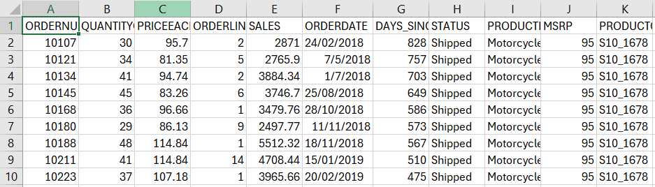
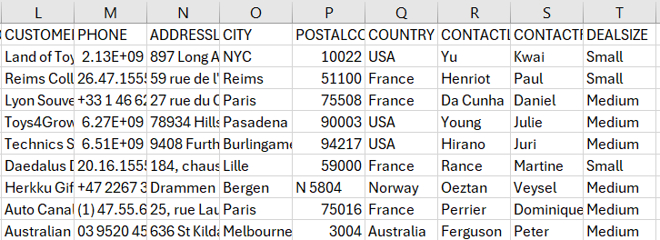

# Part I Database Establishment

As outlined in the project overview, our objective is to transition from their current spreadsheet system to a more robust database solution. This process includes three key phases:

**1. Data Understanding:** This phase involves thoroughly comprehending the existing data and preparing it for the database creation process.

**2. Relational Database Design:**
   Once the data is understood, we proceed to design the relational structure. This involves normalization of tables and establishing the relational database model.

**3. Database Creation:**
   In this final phase, we implement the designed schema, create tables according to the relational model, and import the prepared data into the database.

## 1.1 Data Understanding

Utilizing Excel's quick scan feature due to the small dataset size of 20 attributes and 2,747 examples. Below is the dataset description:

| Column Name          | Description                                                                                                                         |
|----------------------|-------------------------------------------------------------------------------------------------------------------------------------|
| ORDERNUMBER          | This column represents the unique identification number assigned to each order.                                                   |
| QUANTITYORDERED      | It indicates the number of items ordered in each order.                                                                            |
| PRICEEACH            | This column specifies the price of each item in the order.                                                                         |
| ORDERLINENUMBER      | It represents the line number of each item within an order.                                                                        |
| SALES                | This column denotes the total sales amount for each order, which is calculated by multiplying the quantity ordered by the price.  |
| ORDERDATE            | It denotes the date on which the order was placed.                                                                                 |
| DAYS_SINCE_LASTORDER| This column represents the number of days that have passed since the last order for each customer. It can be used to analyze customer purchasing patterns. | 
| STATUS               | It indicates the status of the order, such as "Shipped," "In Process," "Cancelled," "Disputed," "On Hold," or "Resolved."         |
| PRODUCTLINE          | This column specifies the product line categories to which each item belongs.                                                       |
| MSRP                 | It stands for Manufacturer's Suggested Retail Price and represents the suggested selling price for each item.                      |
| PRODUCTCODE          | This column represents the unique code assigned to each product.                                                                   |
| CUSTOMERNAME         | It denotes the name of the customer who placed the order.                                                                          |
| PHONE                | This column contains the contact phone number for the customer.                                                                    |
| ADDRESSLINE1         | It represents the first line of the customer's address.                                                                            |
| CITY                 | This column specifies the city where the customer is located.                                                                      |
| POSTALCODE           | It denotes the postal code or ZIP code associated with the customer's address.                                                     |
| COUNTRY              | This column indicates the country where the customer is located.                                                                   |
| CONTACTLASTNAME      | It represents the last name of the contact person associated with the customer.                                                    |
| CONTACTFIRSTNAME     | This column denotes the first name of the contact person associated with the customer.                                              |
| DEALSIZE             | It indicates the size of the deal or order, which are the categories "Small," "Medium," or "Large."                                |

Here is the example of the dataset:





**Data Sorting**

To start with, sort the order with 2 layers:

* Step 1: enable filter 
* Step 2: ustom sort ordernumer + ordernumberline 


**Redundency Removal**

Storing redundant or derived values in a database can lead to data inconsistency and increase storage requirements without providing significant benefits. Instead, it's often more efficient to calculate such values dynamically when needed, either in SQL queries or in application logic.

Here are the columns that were removed and the reasons why:

| Column Removed        | Reason                                                                                              |
|-----------------------|-----------------------------------------------------------------------------------------------------|
| Sales                 | Calculable using quantity multiplied by price                                                      |
| Date since last order | Calculable based on previous order dates                                                           |
| Dealsize              | Can be defined by the sales numbers already stored in the database                                  |
| Phone                 | Deemed outdated by the CEO; to be replaced by email addresses                                       |

**Datatype** 

It has been noted that certain date and time entries appear as text strings rather than numerical values. To rectify this, utilize the 'Text to Columns' feature to designate the format as Day-Month-Year (DMY). 
Subsequently, ensure consistency by converting all dates to the YYYY-MM-DD format, adhering to the MySQL standard.


## 1.2 Relational Database Design

* Step 1. draft relational dataset using [quickDBB](https://www.quickdatabasediagrams.com/)


It's crucial to acknowledge that the relational database is structured based on the available data rather than an optimal design. There is room for expansion in the future as more comprehensive data becomes available. For instance, enhancing shipment status could involve incorporating ship dates or recording encountered problems.

* Step 2: assign customer id since it's not existing yet

1. use fuciton ```Unique()``` to list out all unique clients name
2. then assign a customer id using simple method  ```="CUS 1000" & ROW(A2)```
3. use ```Xlookup()``` to compare and put the new assigned id back to the main sheet
   


* Step 3: remove duplication of products/customers

   (alternative: the import wizard of MySQL will automatically do the same job too)

* Step 4: split into 3 csv files

  The splited tables mirroring the databse draft above can be found [Here](dataset/) 


## 1.3 Database Creation

* Step 1. create database using mySQL, it's recommendable to use password 

* Step 2. create scheme and tables

  open the SQL script below and run, the corresponding tables will be creates:
   [SQL script for data base creation](SQL%20script/database_creation_auto.sql)

* Step 3. import using table import wizard


* Step 4. confrirm the dataset is intact


