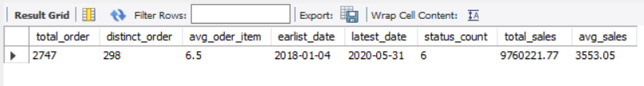
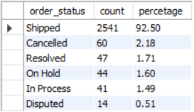
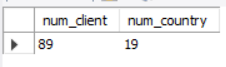
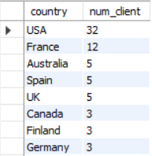
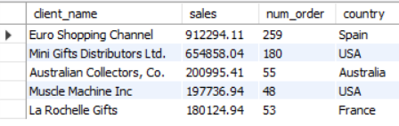
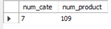
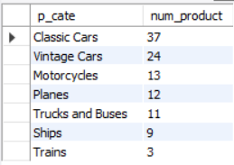
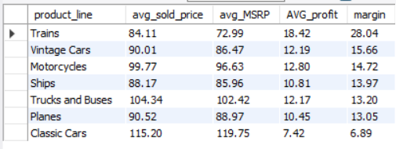
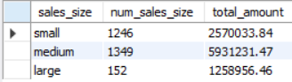

# Part II Data Insight
Follow the previous session of data handling and database creation (See Part I [Here](https://github.com/codyhsu/sql-powerbi-autosales-dataanalysis-dashboard/tree/main/Part%20I%20Database%20Establishment)), this part is for gaining a deeper understanding of the dataset and determining the most relevant insights to visualize in Power BI. SQL will be employed during this session for future scalability.

**1. Data Imspectiom:**
Use SQL to conduct a comprehensive exploration of the dataset, extracting key information and identifying  trends.

**2. Dashboard Element Selection:**
Carefully select the most appropriate visualizations to effectively communicate insights and reveal additional patterns within the data.

**3. SQL Script Preparation:**
Prepare the essential SQL scripts required to seamlessly integrate and establish connections between MySQL and Power BI, ensuring smooth data flow and analysis.

## 2.1 Data Inspection and Summary

**Orders and Salses**

> SQL Query of this part can be also found [Here](SQL_script/autosales_orders.sql)

 ```SQL
-- orders --
SELECT 
	count(o.order_id) AS total_order,
	count(distinct(o.order_id)) AS distinct_order,
	round(avg(order_linenumber),1) AS avg_oder_item,
	DATE(min(o.order_date)) AS earlist_date,
	DATE(max(o.order_date)) AS latest_date,
	count(distinct o.order_status) AS status_count,
	round(sum(o.order_quantity*o.price_sold),2) AS total_sales,
	round(avg(o.order_quantity*o.price_sold),2) AS avg_sales
FROM orders AS o
;

```


```SQL
-- order status --
SELECT 
	distinct(o.order_status),
	count(o.order_status) AS count,
	round((count(o.order_status)/ a.total_order)*100,2) AS percetage
FROM 
	orders AS o,
	(SELECT count(*) AS total_order FROM orders) AS a
GROUP BY 
	o.order_status, a.total_order
ORDER BY 2 DESC
;
```




* 298 distincts order with 2747 items between 2018-01-04 and 2020-05-31
* Total sales are 976,022,177 Euros with an average of 355,305 Euros per order
* There are 6 types of order status: shipped, on hold, in porcess, disputed, resolved and cancelled
* 92.5% of the orders are successfully shipped, 2.18% are cancelled and 5.32% with other status

**Customers**

> SQL Query of this part is [Here](SQL_script/autosales_clients.sql)

```SQL
-- cutomers --
SELECT
	count(distinct(c.client_id)) AS num_client,
    count(distinct(c.country)) AS num_country
FROM customers AS c
;
-- customer by country --
SELECT
	c.country,
	count(distinct(c.client_id)) AS num_client
FROM customers AS c
GROUP BY country
ORDER BY 2 desc
;

-- costomer by sales--
SELECT
	c.client_name,    
    sum(o.order_quantity*o.price_sold) AS sales,
    COUNT(o.order_id) AS num_order,
    c.country
FROM orders AS o
LEFT JOIN customers AS c ON o.client_id = c.client_id 
GROUP BY c.client_name, c.country
ORDER BY 2 DESC
LIMIT 5 
;
```





* There are 89 clients from 19 countries
* Most of them (32) are form USA, 12 from France, 5 each from Australia and Spain
* Top clients are Euro Shopping Channel from Spain with 259 orders and Mini Gifts Distributors Ltd, from USA with 180 orders
  

 **Products**

> SQL Query of this part is [Here](SQL_script/autosales_products.sql)

```SQL
-- products count--
SELECT
	count(distinct(p.product_line)) AS num_cate,
    count(distinct(p.product_code)) AS num_product
FROM products AS p
;

-- product by category --
SELECT
	p.product_line AS p_cate,
    count(distinct(p.product_code)) AS num_product
FROM orders AS o 
LEFT JOIN products AS p ON o.product_code = p.product_code
LEFT JOIN customers AS c ON o.client_id = c.client_id
GROUP BY p.product_line
ORDER BY 2 DESC
;
-- product by category & country --
SELECT
	p.product_line AS p_cate,
    count(distinct(p.product_code)) AS num_product,
    sum(o.order_quantity) AS quantity,
    c.country
FROM orders AS o 
LEFT JOIN products AS p ON o.product_code = p.product_code
LEFT JOIN customers AS c ON o.client_id = c.client_id
GROUP BY p.product_line, c.country 
ORDER BY 1,3 DESC
;

-- profit margin --
SELECT
	p.product_line,
    ROUND(avg(o.price_sold),2) AS avg_sold_price,
    ROUND(avg(p.MSRP),2) AS avg_MSRP,
    ROUND(avg(o.price_sold) - avg(p.MSRP* 0.9),2) AS AVG_profit,
    ROUND(((avg(o.price_sold) - avg(p.MSRP* 0.9))/avg(p.MSRP* 0.9))*100,2) AS margin
  
FROM orders AS o 
LEFT JOIN products AS p ON o.product_code = p.product_code
GROUP BY p.product_line
ORDER BY 5 DESC
;
```





* There are 7 categories and 109 distincts products.
* Categories are:  Classic Cars, Vintage Cars, Motorcycles, Planes, Trucks and Buses,Ships and Trains
* Margin of sales are range from 7.42% to 18.42% [^1].
* Classic cars offer the most variety with 37 products yet with the lowest margin of 6.88%, while train vice versa
* All categories' top buyers are all from the USA

[^1]: margin are cauculated using 90% of the MSRP as the base price


## 2.2 Dashboard Elements Selection

A. Key Figure
1. Orders: Total Orders
2. Orders:Total Sales
3. Orders: Average Sales
4. Orfers: Total Margin
5. Products: Number of Category
6. Products: Total items 
7. Customers: Total Clients  

B. Proportion
1. Orders: Status/ Shipped, disputed, cancelled
2. Produts: product category (treemap)

C. Insight
1. Profit margin of each category
2. Sales vs top clients vs products
3. Sales vs Time for purchase for pattern/ behavior
4. Country vs Sales
5. Dealsize (each order) vs Customer

To prepare Insight Number 5 in Part C, focusing on 'Dealsize', we utilize a 'CASE' statement for defining size categories.
* Sales exceeding $7000 are classified as 'Large'.
* Sales between $3000 and $7000 are categorized as 'Medium'.
* Any sales below $3000 are labeled as 'Small'.


```SQL
SELECT
    CASE 
        WHEN o.order_quantity * o.price_sold > 7000 THEN "large"
        WHEN o.order_quantity * o.price_sold > 3000 THEN "medium"
        ELSE "small"
    END AS sales_size,
    count(o.order_id) AS num_sales_size,
    SUM(o.order_quantity* o.price_sold) AS total_amount
FROM orders AS o
LEFT JOIN products AS p ON o.product_code = p.product_code
LEFT JOIN customers AS c ON o.client_id = c.client_id
GROUP BY sales_size;

```



As indicated by the results, the majority of deals fall within the 'Medium' and 'Small' categories, with only a few classified as 'Large'. We will incorporate this 'CASE' statement into the subsequent selection script for more in-depth customer analysis in Power BI.


## 2.3 SQL Script Preparation 


Given the three tables - orders, customers, and products - I've utilized aliases: 
* 'o' for orders
* 'c' for customers
* 'p' for products.

Below is the SQL script prepared to set the stage for visualization. I've also included notes indicating which selected elements will be utilized in specific visuals for reference.

``` SQL
SELECT
o.order_id, -- A1. number of order
o.order_quantity, -- A2 total sales (quantity* sales)
o.price_sold, -- A2 total sales (quantity* sales) 
o.order_quantity* o.price_sold AS sales, -- A3, C2, C3, C4
(o.price_sold - p.MSRP*0.90)* o.order_quantity AS profit, --A4, C1
p.product_code, -- A6
p.product_line, -- A5, B2, C1, C2
c.client_name, --A7, C2
o.order_status, -- B1
o.order_date, -- C3
c.country, -- C4
CASE 
        WHEN o.order_quantity * o.price_sold > 7000 THEN "large"
        WHEN o.order_quantity * o.price_sold > 3000 THEN "medium"
        ELSE "small"
END AS sales_size -- C5

FROM orders AS o
LEFT JOIN products AS p ON o.product_code = p.product_code
LEFT JOIN customers AS c ON o.client_id = c.client_id 
;
```

## NEXT 

Building on the prepared scripts, we constructed an interactive dashboard in Power BI. This involved:

* Connecting the SQL database for seamless data flow.
* Transforming data into clear visualizations.
* Adding interactive features for user exploration.

Explore the dashboard's functionalities and captivating visualizations in the next session: 
You can access the next session through the following link [Part III Interactive Dashboard](https://github.com/codyhsu/sql-powerbi-autosales-dataanalysis-dashboard/tree/main/Part%20III%20Interactive%20Dashboard)


