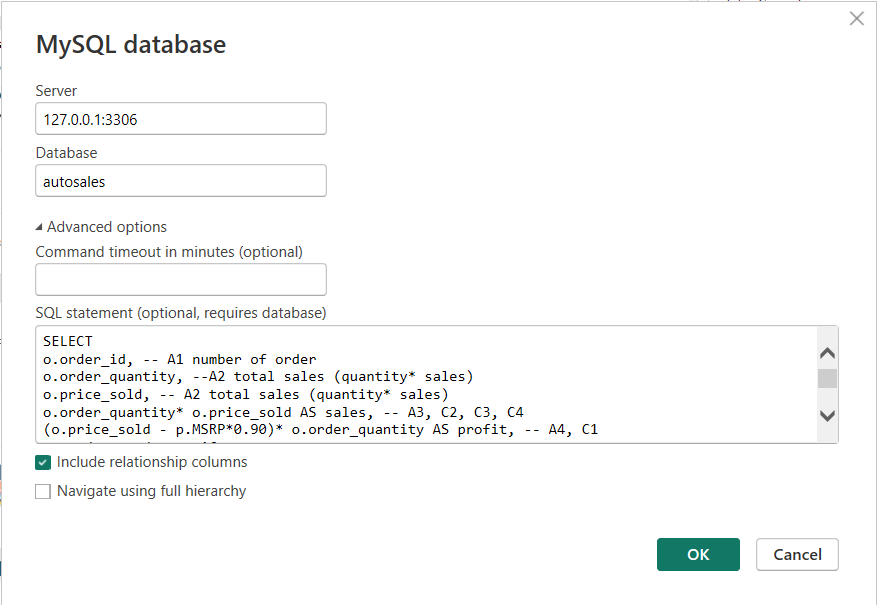
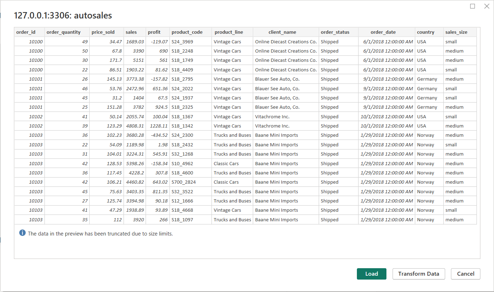
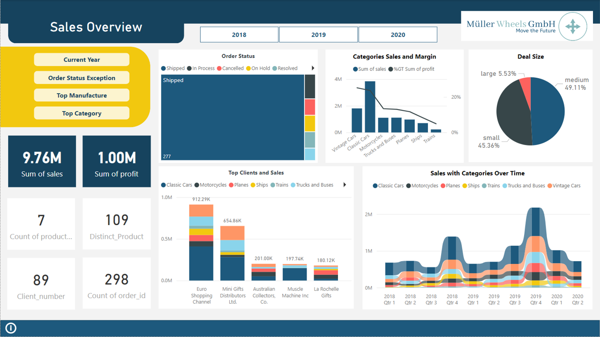
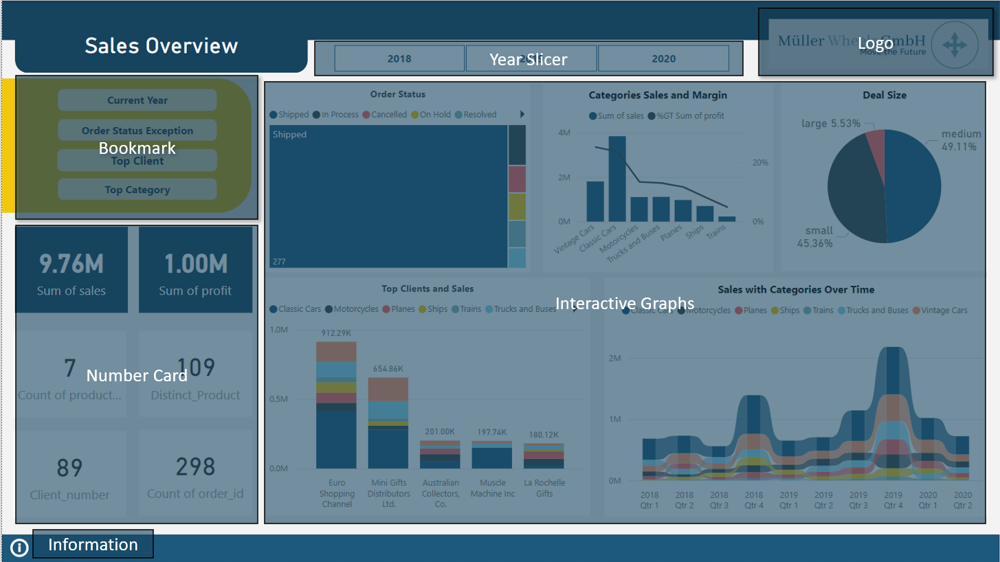
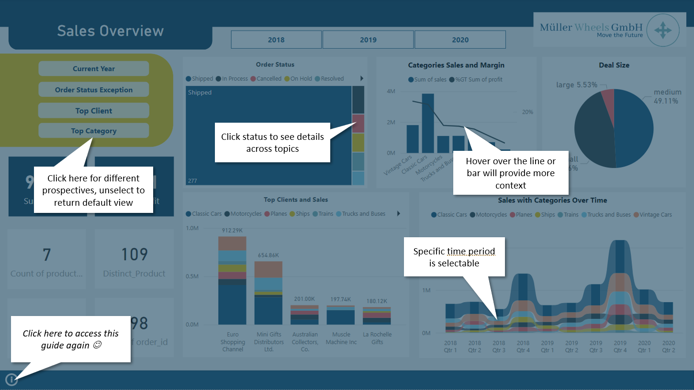
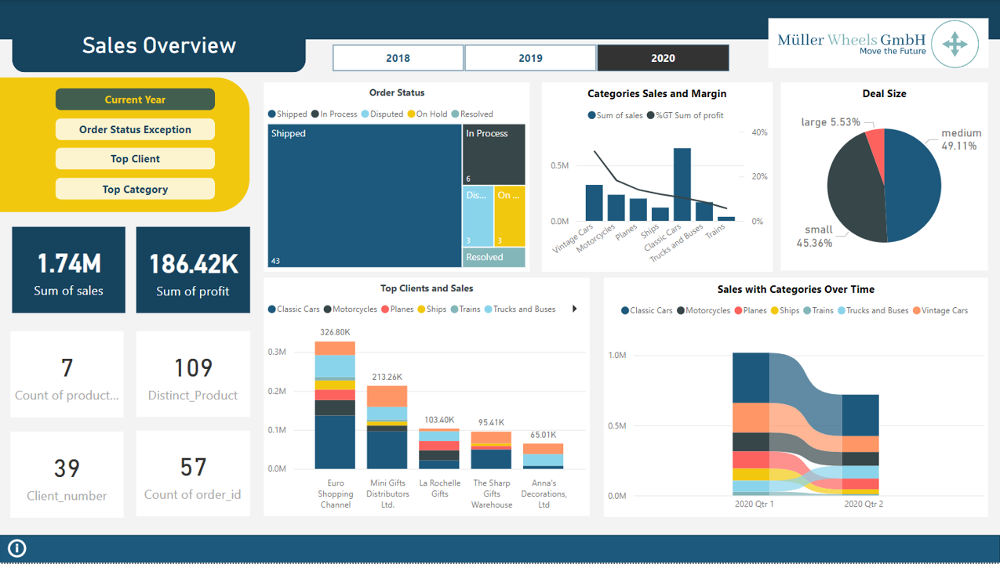
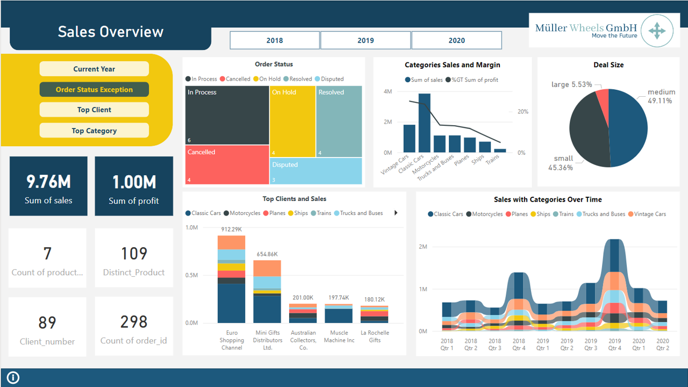
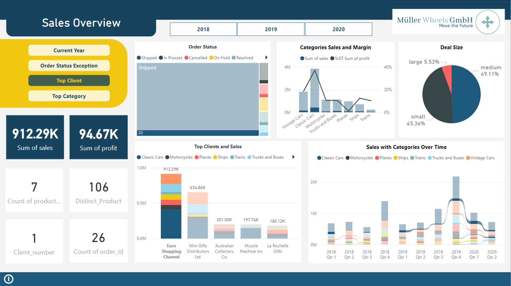
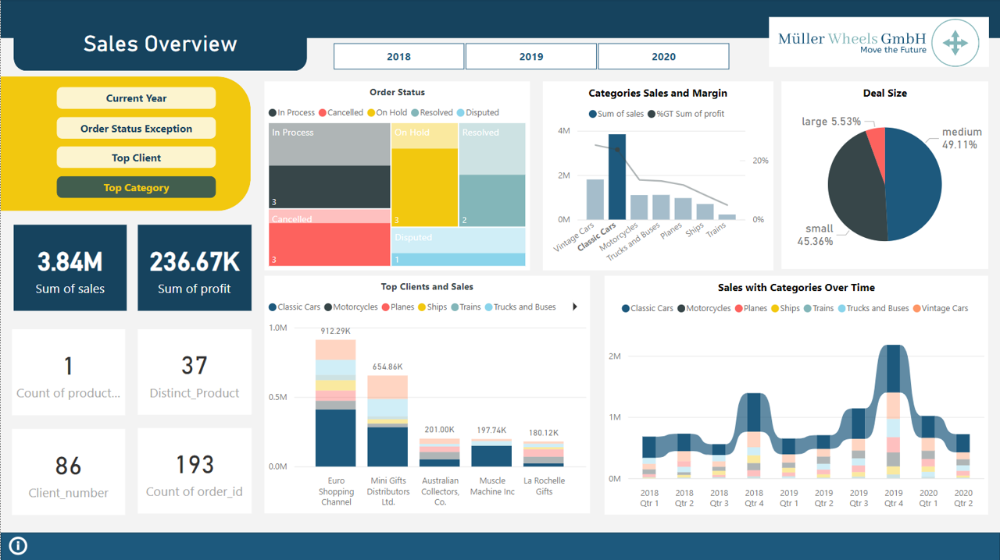

# Part III Interactive Dashboard

Building upon the insights gained in the previous chapter, I have delved deeper into the autosales dataset, identified suitable visualizations, and devised an SQL script to establish connectivity between MySQL and Power BI. 

This chapter now proceeds to construct an interactive dashboard within Power BI, detailing the key steps undertaken:

1. Connect to Power BI :

   - Establish connection with Power BI to begin dashboard creation.

2. Dashboard Creation:

   - Implement a variety of visualization tools including scorecards, treemaps, histograms, and maps to present data effectively.
   - Incorporate a distinct logo to personalize the dashboard and enhance brand identity.

3. Storytelling Elements:

   - Utilize bookmarks and narrative techniques to weave a cohesive storyline throughout the dashboard, guiding users through the data insights and interpretations seamlessly.

## 3.1 Connect to Power BI

Here are the steps I took for establishing connection with Power BI to begin dashboard creation
* Step 1: Initiate Data Import: In Power BI Desktop, navigate to the Home tab and click Get Data. Then, select MySQL from the list of data sources.

* Step 2: Specify Connection Details: Enter the server name and database name in the corresponding fields. You can refer to the image below.

* Step 3: Import with SQL Script : Use the prepared (SQL script)[SQL_script/autosales_powerbi.sql] 

## 3.2 Dashboard Creation

**Goal:** To create a visually appealing and informative dashboard that effectively communicates key performance indicators (KPIs) and data insights.

**Tools:** Microsoft Power BI (Free Version), _so it's unfortunately unable to share the board directly, I will try my best to capture the details_

**Description:**

The dashboard utilizes various visualizations, including scorecards, treemaps, and histograms, to present data about sales, revenue, and other insught/
Here is the snapshot of how it looks like: 

**Key Features:**

* **Branding:** Incorporates a distinct logo to personalize the dashboard and enhance brand identity.
* **Bookmark:** Enhance storytelling experience, will be explained in the next chapter.
* **Number Cards:** Display essential metrics like sales, revenue, and COGS on the left lower part.
* **Data Insights:** Provide an overview of key trends across the entire timeframe, including product category margins, order activity over time, top 5 client information, and deal size distribution.
* **Interactive Information Panel:** Located in the bottom left corner, it provides additional context when clicked and can be closed by clicking anywhere within the panel. 

 

## 3.3 Storytelling

**Goal:** To guide users through the dashboard and highlight key insights through interactive bookmarks.

**Description:**

Four bookmarks have been created to provide a guided storytelling experience, allowing users to explore the data at their own pace.

 **1. Current Year:** Focuses on data for the current year (simulated as 2020 based on the provided timeframe).

 

 **2. Order Status Exception:** While the overall shipping success rate of 90% is positive, this bookmark allows users to delve into the remaining 10% for a deeper understanding of any fulfillment issues.

 

 
 **3. Top Category:** Provides detailed insights into sales, order status, revenue, and COGS for the top product categories. This serves as an example for users to understand how visualizations change when selecting different categories.

 

 
 **4.Top Client:** Offers a closer look at the performance of the top five clients.

 

## Conclusion

This project, titled "AUTOSALES: Data Analysis & Interactive Dashboard," provided a valuable opportunity to experience the entire data analysis pipeline from start to finish. Witnessing the transformation of raw data into an interactive dashboard solidified the importance of:

* **Asking the Right Questions:**  Throughout the process, formulating insightful questions about the sales data drove the direction of the analysis and ultimately shaped the dashboard's functionality. 
* **Selecting the Right Tool:**  Choosing the appropriate tool for each stage, from data manipulation in Excel to database creation in MySQL and finally visualization in Power BI, ensured efficient execution and optimal results.
* **Connecting the Dots:**  Connecting seemingly disparate data points to uncover meaningful trends and insights was a crucial aspect of the analysis. This experience highlighted the power of data storytelling and its ability to inform decision-making.

**Through this process, I gained valuable experience in:**

* Data cleaning and manipulation techniques in Excel.
* Relational database design and implementation in MySQL.
* Data visualization best practices and interactive dashboard creation using Power BI.

The project presented its fair share of challenges.  Connecting data between Excel, MySQL, and Power BI sometimes led to troubleshooting sessions that lasted hours or even days. Making the data presented in the desirable way takes several youtube videos. Overcoming these hurdles, especially when striving for a specific outcome, wasn't always easy. However, by leveraging online resources and the power of AI assistance, I was able to find solutions and refine my approach.

I believe the transferable skills gained from this project extend far beyond the automotive industry. The ability to understand the strengths of each tool and apply them effectively across different tasks is an invaluable asset. 

* Marketing Analysis: By leveraging the skills developed in data cleaning, database management, and visualization, I could analyze marketing campaign data to identify trends, measure ROI, and optimize future strategies.
* Financial Analysis: Similar skills could be applied to analyze financial data, assess investment opportunities, and create clear reports for stakeholders.
* Social Media Analytics: Analyzing social media data to understand audience demographics, gauge brand sentiment, and inform content creation strategies is another potential application.

This project serves as a springboard for continuous learning and exploration of new tools and techniques. As data continues to play an increasingly important role across various industries, the ability to extract meaningful insights will remain a highly sought-after skill.

